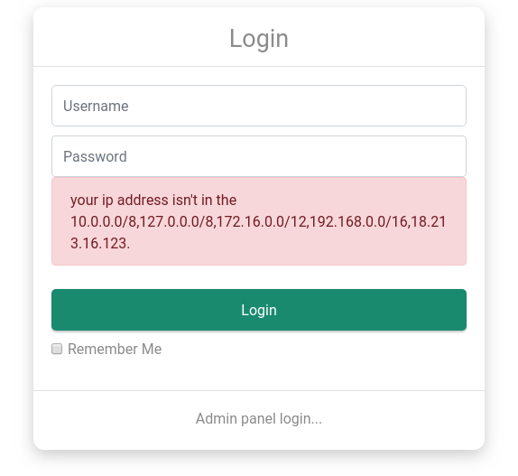

# Real World CTF 2018: bookhub (web, 208 pts)
###### By @Vtec234, @JoshGreen0x04, @hstocks

The challenge description reads:

> How to pwn bookhub?
>
> http://52.52.4.252:8080/
>
> hint: www.zip

## Part 0: Production website

Going to the provided link we see a website with a list of books. Being named Bookhub, it makes sense. There is a single page and nothing seems to be clickable. We could spend time black-boxing the site, but it's much easier to just look at the provided zip.

As it turns out, the archive contains the source for the entire server. Thanks, organisers! Digging through the sources reveals a couple of interesting points about the backend. `SQLAlchemy` is used for interacting with an SQLite database containing users and books, and the session storage is backed by a local Redis instance. There is also some CSRF protection via the `csrf_token` parameter and middleware.

A couple of `/admin/` endpoints are exposed, but all of them (appear to) require a logged in session. The only endpoint available to us at this point is `/login/`. Let's try logging in!

Doing so, we are met with a curious error message:



## Part 1: Debug website

Most of the listed IP ranges are just typical internal adresses, but the last one is different. Let's see what happens when we go to it. Nothing on port `8080`, but `5000` contains a debug version of the same website, which greets us with a promising alert:

> The bookhub is running in debug mode, which can lead to security issues!

We love a good publicly accessible debug instance! Digging through the sources some more, we noticed that a couple of admin endpoints are gated behind the following check:

```python
if app.debug:
    """
    For CTF administrator, only running in debug mode
    """
```

However, it seems all of them still require a valid logged in session, validated by the flask `@login_required` decorator.

At this point we were somewhat confused, seeing nothing that would  allow access to more interesting functionality. We started blackboxing every endpoint, and realised that `/admin/system/refresh_session/` was somehow allowing access, even though it clearly shouldn't.

One of our team members' eyes got drawn to the order of decorators. Every handler other than `/admin/system/refresh_session/` had something like this above it:

```python
@user_blueprint.route('/admin/system/change_name/', methods=['POST'])
@login_required
```

but in `refresh_session` their order was reversed. Now, this seems like it really shouldn't matter, but somehow it did. We shrugged it off in interest of time and proceeded with the exploit (part 2). The analysis below is post-factum.

In Python, decorators are higher-order functions that take the function to be decorated as an argument and return another function, usually with additional code injected, which the Python runtime replaces the original function with. If this sounds confusing, that's because it is, but there are good explanations available online. Decorators are executed bottom-to-top. This means that in the case of `refresh_session`, `@app.route` is ran before `@login_required`.

As it happens `@app.route` is not a traditional decorator. It misuses the decorator callsite to register the function it is called with in the application handlers table:

```python
def route(self, rule, **options):
  def decorator(f):
      endpoint = options.pop('endpoint', None)
      self.add_url_rule(rule, endpoint, f, **options)
      return f
  return decorator
```

Here, `decorator` is the actual decorator, and `route` is a function that returns a decorator given the routing arguments.. phew. The `decorator` decorator doesn't inject any code. Instead, it adds the user-written handler to the rules table and returns that same handler.

Due to the order of decorator execution, the registered handler is not the one with `@login_required` injected, because that happens later (and hence the correct handler is never used)!

A [Stack Overflow answer](https://stackoverflow.com/questions/28204071/does-the-order-of-decorators-matter-on-a-flask-view#28204335) we found on this subject mentions that there "probably won't be any problem", and the [Flask-Login docs](https://flask-login.readthedocs.io/en/latest/#flask_login.login_required) never mention it either. Maybe this is obvious to people writing server code, but you would expect them to at least mention something as important as this! Talk about RealWorld challenges..

## Part 2: Redis

The `/refresh_session/` POST doesn't take any parameters. Its handler [executes some Lua code](https://redis.io/commands/eval) in the Redis Lua environment. The code is meant to delete every session except ours:

```lua
local function has_value (tab, val)
  for index, value in ipairs(tab) do
    if value == val then
       return true
    end
  end

  return false
end

local inputs = {{ "{prefix}{sessionid}" }}
local sessions = redis.call("keys", "{prefix}*")

for index, sid in ipairs(sessions) do
  if not has_value(inputs, sid) then
    redis.call("del", sid)
  end
end
```

The `prefix` variable is always just `bookhub:session:`, but `sessionid` is user-controlled, via the `bookhub-session` cookie. This means that we can get Lua code execution! To do so, we simply need to create a session with a malicious id containing the Lua to inject, obtain the `csrf_token` for it, and then POST to `refresh_session`.

So we have Lua execution, but we are still not quite there. The code is executed in a sandbox, and while escapes from it are [often the subject of CVEs](http://antirez.com/news/119), the latest Redis version was used and we didn't feel like looking for Lua zerodays.

While full access would be nice, even getting a simple leak was a challenge. The `/refresh_session/` POST request could only return a binary "success" or "failure" - no other information such as the Lua execution output.

_Really_ hoping we wouldn't have to deal with a blind binary injection, we went looking for anything useful in the Redis API and found the grail: [MIGRATE](https://redis.io/commands/migrate). This command allows sending keys to another Redis server anywhere on the internet. And since we could store arbitrary variables and results as keys in Redis via e.g. `redis.call("set", "leakey", redis.call("info"))` and then migrate them to our controlled Redis instance, we had our info leak.

At this point we got quite stuck again, spending a lot of time trying to scope out the Redis instance, as well read some of the present keys (and hence other teams' exploit attempts :), _sasza.net we see you_).

However, we couldn't find any usable info (all sessions kept getting deleted) and there wasn't any other database or hidden key that had a flag in it. So the only possible place the flag could be is on the server's filesystem itself, and we would need a remote shell to find it. Cue another round of documentation reading.

Eventually, one of our members noticed the following configuration variable in the Redis `Flask-Session` backend:

> SESSION_USE_SIGNER
> Whether sign [sic] the session cookie sid or not, if set to True, you have to set flask.Flask.secret_key, default to be False

A bit of explanation. This variable controls whether the key corresponding to our session and stored in Redis is signed or not. As `SESSION_USE_SIGNER` is never set in `__init__.py`, the keys are **not signed**! The data corresponding to the key is serialized Flask session metadata. The specific contents of this metadata would matter if we wanted to forge an admin session, but notice something else - it is _serialized_.

P.S. We realised later that even if the session ids were signed, we could still probably exploit the application, because the session backend doesn't seem to ever sign the metadata itself. During the CTF we assumed that it would, as it does when the session data is stored in a cookie.

## Part 3: Python

Looking at the implementation of `RedisSessionInterface` revealed that `pickle` is used for serializing the metadata. On session retrieval, this data is deserialized straight from whatever is stored in Redis:

```python
serializer = pickle

...

val = self.redis.get(self.key_prefix + sid)
if val is not None:
  try:
    data = self.serializer.loads(val)
```

`pickle` is well-known to be completely unsafe when it comes to deserializing untrusted data and is trivial to get code execution in. Since we have Lua execution in the Redis context, we can add a malicious session metadata entry with any chosen session id as the key. The data will get deserialized, and `pickle` will execute our code, granting a reverse shell.

The final payload we used as the `sessionid` in our POST to `refresh_session` ended up being:

```lua
a} function string.fromhex(str) return (str:gsub(\'..\', function(cc) return string.char(tonumber(cc, 16)) end)) end redis.call("set", "bookhub:session:test6", string.fromhex("hex encoded malicious pickle data")) do return end local foo = {
```

(Surround in double quotes for it to work, we've left it this way for that lovely Markdown syntax highlighting.)

Then we simply requested a page from the site, with the `bookhub-session` cookie set to `test6` and the `pickle` payload was executed serverside, granting us a shell.

You can generate the malicious `pickle` data using [this gist](https://gist.github.com/mgeeky/cbc7017986b2ec3e247aab0b01a9edcd).

Using our shell, we read the flag from a `readflag` binary conveniently placed by the challenge authors: `rwctf{fl45k_1s_a_MAg1cal_fr4mew0rk_t0000000000}`
